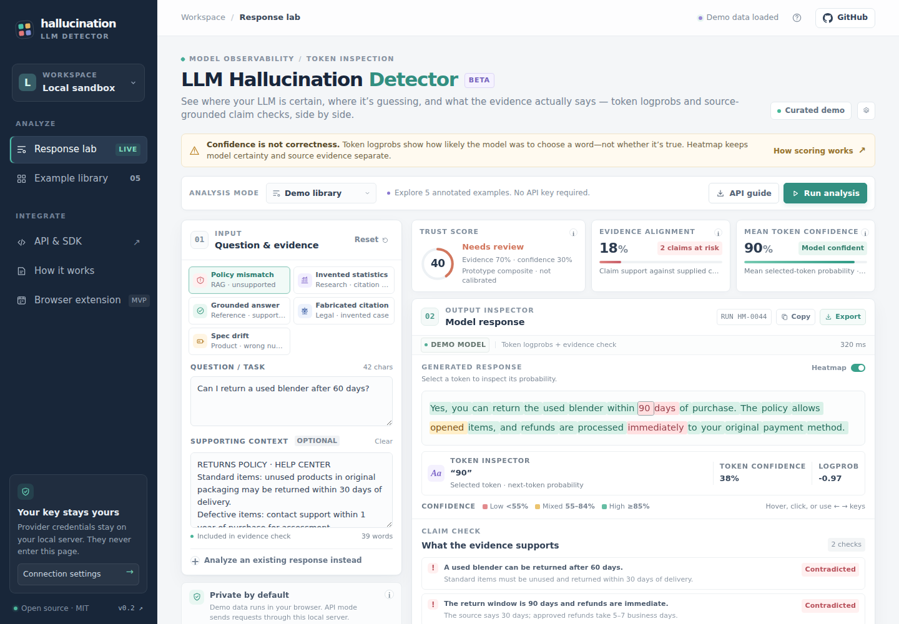
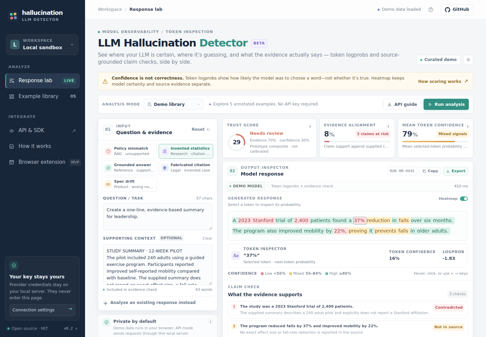
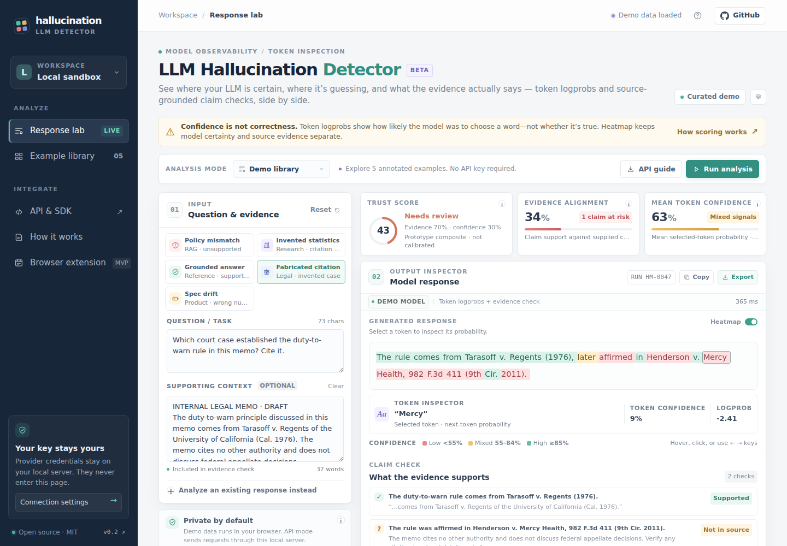
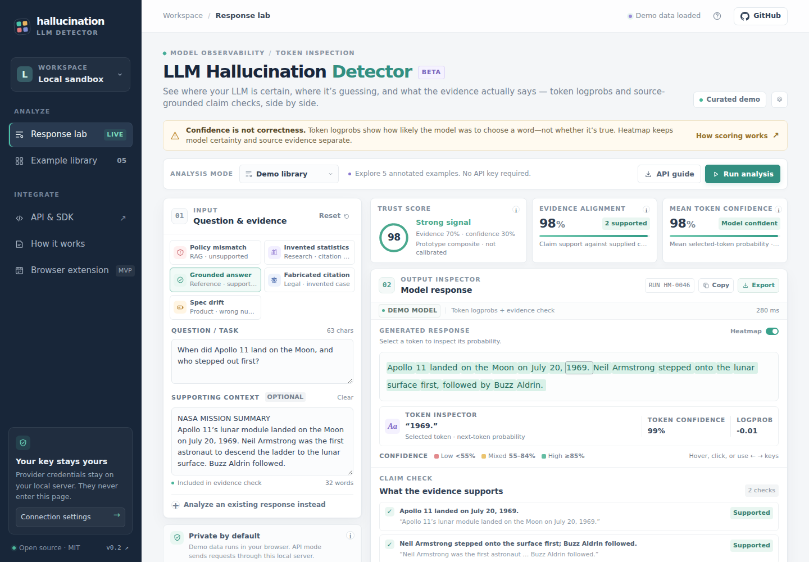
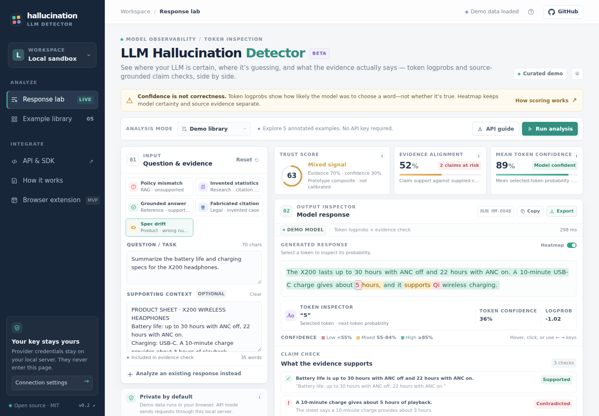
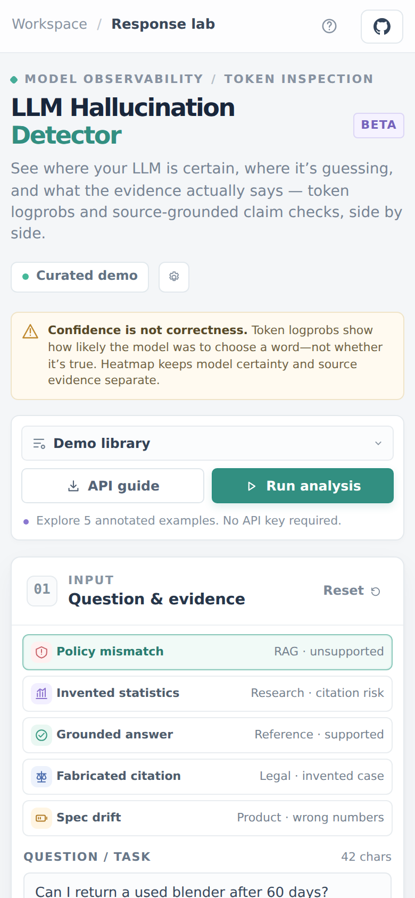

<div align="center">


# LLM Hallucination Detector

### Catch LLM hallucinations before your users do.

Your model says *"Yes, returns are accepted within 90 days"* with **89% confidence**, and your policy says **30**.<br>
LLM Hallucination Detector colours every token by how sure the model was **and** checks every claim against your own sources, so confident mistakes stop slipping through.

[](https://github.com/SYasJ/llm-hallucination-detector/actions/workflows/ci.yml)
[](LICENSE)


**[▶ Try the live demo](https://syasj.github.io/llm-hallucination-detector/)**: no install, no sign-up, no API key.

[📖 Wiki](https://github.com/SYasJ/llm-hallucination-detector/wiki) · [Quick start](#quick-start) · [Examples](examples/) · [API](#local-http-api) · [Chrome extension](#chrome-extension-chatgpt--claude)



</div>

## Why LLM Hallucination Detector?

- **Spot the guess.** Invented numbers, names, dates and citations usually show up as red, low-probability tokens.
- **Prove it against your docs.** Each claim is marked *supported*, *contradicted* or *not in source*, with the quote that backs it up.
- **Gate your RAG pipeline.** A 0–100 trust score and a JSON export plug straight into evaluation and guardrails.
- **Works with what you already use.** Any OpenAI-compatible API, pasted ChatGPT or Claude answers, and a Chrome extension.
- **Runs on your machine.** Zero dependencies, your API key never leaves your server, and it's MIT licensed.

LLM Hallucination Detector (formerly *Hallucination Heatmap*) is an open-source, local-first tool for **LLM hallucination detection**. It keeps two signals apart that are easy to mix up:

| Signal | What it measures | Where it comes from |
| --- | --- | --- |
| **Token confidence** | How likely the model was to pick each token: `exp(logprob)` | `logprobs` from any OpenAI-compatible Chat Completions API |
| **Evidence alignment** | Whether each factual claim is *supported*, *contradicted* or *not in source* | A verifier model checks the answer against the context you supply (RAG documents, policies, references) |

A fluent answer can be 90% "confident" and still contradict your source. The heatmap shows you both, side by side.

> **Logprob is not truth.** A model can be highly confident in a false claim, and verifier judgments can also be wrong. The trust score is a transparent prototype heuristic, not a calibrated probability of correctness.

## Features

- 🔥 **Token heatmap.** Every token is coloured by probability (red < 55%, amber 55–84%, green ≥ 85%). Hover, click, or use the arrow keys to inspect the logprob.
- ✅ **Claim check against sources.** Atomic claims get verdicts with quoted evidence from your context.
- 📊 **Trust score and JSON export.** `llm-hallucination-detector/v1` records hold scores, verdicts and token logprobs for RAG and evaluation pipelines.
- 🧪 **Five built-in demos, no API key.** Policy mismatch, invented statistics, a grounded answer, a fabricated legal citation, and product-spec drift.
- 🔌 **Any OpenAI-compatible provider.** OpenAI, Azure OpenAI, vLLM, Together, Groq, LM Studio, Ollama's `/v1` endpoint, and others. Falls back to verifier mode when logprobs aren't supported.
- 🧩 **Chrome extension.** Adds an *Analyze answer* button to ChatGPT and Claude responses.
- 🔒 **Local-first and hardened.** Keys stay server-side. The server binds to localhost and blocks DNS rebinding and cross-site requests (see [Security](#security)).
- 📦 **Zero dependencies.** Python standard library and vanilla JavaScript only.

## Quick start

Requirements: Python 3.10 or newer. Nothing to install.

```bash
git clone https://github.com/SYasJ/llm-hallucination-detector.git
cd llm-hallucination-detector
python3 server.py
```

Open <http://localhost:8787>. The demo library works immediately, without credentials.

### Connect a model

```bash
cp .env.example .env      # then edit .env
python3 server.py
```

```dotenv
LLM_BASE_URL=https://api.openai.com/v1
LLM_API_KEY=your-key
LLM_MODEL=gpt-4o-mini

# Optional: a different verifier for a less correlated check
VERIFIER_BASE_URL=https://api.openai.com/v1
VERIFIER_API_KEY=your-verifier-key
VERIFIER_MODEL=your-verifier-model
```

`LLM_BASE_URL` is the provider's Chat Completions root (normally the `/v1` URL, not `/chat/completions`). The browser never receives the key, and `/api/config` reports only whether one is set.

### Try it offline (no API key)

A deterministic mock provider is included for demos, tests and CI:

```bash
python3 examples/mock_provider.py &                                   # fake OpenAI-compatible API on :9999
LLM_BASE_URL=http://127.0.0.1:9999/v1 LLM_API_KEY=mock python3 server.py
```

Its verdicts come from a naive keyword check and are **not real**. Use it only to exercise the pipeline.

## Analysis modes

| Mode | What happens | Trust score |
| --- | --- | --- |
| **Demo library** | Five curated, labelled examples. No network calls. | Fixed demo values |
| **OpenAI-compatible · logprobs** | Generates an answer with `logprobs=true`. If you supplied context, a verifier checks the claims. | `0.7 × evidence + 0.3 × mean token confidence` with context. None without context |
| **Verifier mode · no logprobs** | Generates an answer, or takes a pasted one, then audits its claims. | Evidence-only with context. None without context |

**Reviewing ChatGPT, Claude or other closed models:** expand *Analyze an existing response instead*, paste the answer, choose **Verifier mode**, and run. The original token logprobs can't be recovered, so only claim-level review is available.

## Examples

The [`examples/`](examples/) folder contains runnable scripts:

| File | What it shows |
| --- | --- |
| [`rag_gate.py`](examples/rag_gate.py) | Block or escalate a RAG answer when its trust score is low or a claim is contradicted |
| [`batch_eval.py`](examples/batch_eval.py) + [`dataset.jsonl`](examples/dataset.jsonl) | Score a JSONL dataset and write a CSV report |
| [`curl.sh`](examples/curl.sh) + [`requests/`](examples/requests/) | Raw HTTP requests for each mode |
| [`mock_provider.py`](examples/mock_provider.py) | Offline OpenAI-compatible provider for demos and CI |

### Python client

```python
from heatmap_client import HeatmapClient   # zero-dependency, single file

heatmap = HeatmapClient()                  # or HeatmapClient("http://host:8787"), or set HEATMAP_URL
run = heatmap.analyze(
    "Can I return this item after 60 days?",
    context="Unused items may be returned within 30 days.",
    mode="logprobs",
)
if run["trust_score"] is None or run["trust_score"] < 70:
    print("Needs review:", [c["claim"] for c in run["claims"] if c["status"] != "supported"])

# Verify an answer you already have (e.g. from a closed API)
review = heatmap.verify_existing("Does this follow the policy?", "Yes, within 90 days.", context="30-day returns.")
```

## Local HTTP API

| Endpoint | Description |
| --- | --- |
| `POST /api/analyze` | Body: `{prompt, context?, mode: "logprobs" \| "verify", existing_response?}`. Requires `Content-Type: application/json`. |
| `GET /api/health` | `{ok, service, version}` |
| `GET /api/config` | Non-secret configuration status: model names and sanitized base URLs |

```bash
curl -s http://localhost:8787/api/analyze \
  -H 'Content-Type: application/json' \
  -d '{"prompt": "Can I return a used blender after 60 days?",
       "context": "Unused items in original packaging: return within 30 days.",
       "mode": "logprobs"}' | python3 -m json.tool
```

<details>
<summary>Response shape</summary>

```jsonc
{
  "id": "HM-1A2B3C4D",
  "output": "Yes, you can return the used blender within 90 days…",
  "tokens": [{"token": "Yes", "confidence": 0.95, "logprob": -0.05}, …],
  "claims": [{"claim": "…", "text_span": "…", "status": "contradicted", "confidence": 0.9, "evidence": "…"}],
  "evidence_score": 18.0,          // 0–100, null without context
  "mean_token_confidence": 89.4,   // 0–100, null without logprobs
  "trust_score": 39.4,             // 0–100, null when not source-grounded
  "score_method": "composite",     // "composite" | "evidence_only" | null
  "analysis_method": "logprobs",   // "logprobs" | "verifier"
  "warnings": [],
  "caveat": "Token confidence is not factual truth. …"
}
```
</details>

### How the score works

```text
trust_score = 0.70 × evidence_alignment + 0.30 × mean_token_confidence
```

Claim weights: supported = 1.0, not in source = 0.2, unverified = 0.25, contradicted = 0. Each verdict is pulled toward 0.5 in proportion to the verifier's uncertainty. Without source context, no source-grounded score is produced. These weights and cutoffs are for prototyping and have not been validated. Tune them on your own labelled data.

## Chrome extension (ChatGPT & Claude)

`extension/` is a Manifest V3 extension. It adds an **Analyze answer** button under assistant messages on chatgpt.com and claude.ai. Nothing is read or sent until you click. On click, the response text goes only to your local analyzer (`127.0.0.1:8787`) for a verifier-only review, and claims are highlighted in place with the CSS Custom Highlight API.

1. Run `python3 server.py` with a verifier key configured.
2. Open `chrome://extensions` and turn on **Developer mode**.
3. Click **Load unpacked** and select the `extension/` folder.
4. Refresh ChatGPT or Claude and click **Analyze answer**.

The page selectors are best-effort and can break when either site changes. The extension attaches no source context, so its verdicts are not source-grounded. To lock the API to your extension, set `ALLOWED_EXTENSION_IDS`.

## Screenshots

| Invented statistics | Fabricated citation |
| --- | --- |
|  |  |
| **Grounded answer** | **Spec drift** |
|  |  |

<p align="center"></p>

Screenshots are real browser captures of the demo states. Regenerate them with `node tools/capture_screenshots.mjs` (requires Playwright).

## Security

- **Keys stay server-side.** They're read from `.env` (git-ignored), never served or returned by the API.
- **Localhost by default.** The server binds to `127.0.0.1`. Set `ANALYZER_HOST=0.0.0.0` only on a trusted network, because the API has no user authentication.
- **DNS-rebinding protection.** API requests must carry a local `Host` header. Add others with `ALLOWED_HOSTS`.
- **Cross-site request blocking.** Foreign `Origin`s get a 403, and `POST` requires `application/json`, which forces a CORS preflight.
- **Static allowlist.** Only the web UI files are served. `server.py`, `.env`, tests and `.git` return 404, and directory listings are disabled.
- **Hardened headers.** Strict Content-Security-Policy (no inline scripts or styles), `X-Frame-Options: DENY`, `nosniff`, `Referrer-Policy` and `Permissions-Policy`.
- **Abuse limits.** Per-IP rate limit (`RATE_LIMIT_PER_MINUTE`, default 30), body size caps, and a socket timeout.
- **Prompt-injection hygiene.** Prompts, context and responses are passed to models as JSON data with an instruction to treat them as untrusted.
- **No sensitive logging.** Payloads are never logged.

See [SECURITY.md](SECURITY.md) for how to report a vulnerability.

## Deploying the demo to GitHub Pages

One-time setup: open **Settings → Pages → Build and deployment** and set **Source** to **GitHub Actions**. After that, every push to `main` runs `.github/workflows/pages.yml` and publishes the static front end to <https://syasj.github.io/llm-hallucination-detector/>. You can also start a deploy by hand from the **Actions** tab with **Run workflow**. The demo library runs fully in the browser. Live analysis always needs `server.py` running locally.

## Development

```bash
python3 -m unittest discover -s tests -v   # unit, HTTP security, and end-to-end tests (mock provider)
node --check app.js
```

```text
index.html / styles.css / app.js   Browser workbench (vanilla JS, strict CSP)
server.py                          Standard-library API + static server
heatmap_client.py                  Zero-dependency Python client
examples/                          RAG gate, batch eval, curl requests, mock provider
extension/                         Manifest V3 ChatGPT/Claude helper
tests/                             unittest suite (no network needed)
tools/capture_screenshots.mjs      Playwright screenshots, OG image, icons
assets/ screenshots/               Icons, social card, README images
```

See [CONTRIBUTING.md](CONTRIBUTING.md) and the [CHANGELOG](CHANGELOG.md).

## License

[MIT](LICENSE) © Yasir Jilani and LLM Hallucination Detector contributors.

<sub>Keywords: LLM hallucination detection, token logprobs visualization, RAG evaluation, claim verification, AI fact-checking, LLM observability, trust score, OpenAI logprobs, ChatGPT and Claude answer review.</sub>
