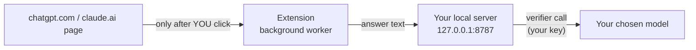

# 🧩 Chrome Extension (ChatGPT & Claude)

Adds an **Analyze answer** button under assistant messages on **chatgpt.com** and **claude.ai**. Claims are highlighted right in the page (red = contradicted, amber = unverified, green = supported), and a review panel shows the verdicts.

## Install (developer mode)

1. Start the local server with a verifier key: `python3 server.py`
2. Open `chrome://extensions` and turn on **Developer mode** (top right).
3. Click **Load unpacked** and select the repo's **`extension/`** folder.
4. Refresh ChatGPT or Claude and click **Analyze answer** under any response.

## Privacy model

- Nothing is read or sent until you click.
- Text goes **only** to your own local server, never to a third-party service run by this project.
- It needs host permissions for the local analyzer only. Content scripts are limited to the two chat sites.

> [!NOTE]
> The extension attaches **no source context**, so verdicts are a best-effort review rather than source-grounded truth. Chat sites change their page structure often, so the button placement is best-effort too.

**Lock it down:** set `ALLOWED_EXTENSION_IDS=<your extension id>` so only your copy can call the API.
