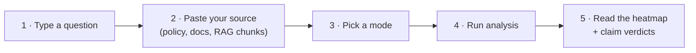

# 🚀 Getting Started

Get from zero to your first hallucination report in about a minute.

## 0. Just want to look? → [open the live demo](https://syasj.github.io/llm-hallucination-detector/)

The hosted demo runs entirely in your browser with five curated scenarios. Nothing to install and no key needed.

## 1. Run it locally

> [!NOTE]
> **Requirements:** Python **3.10+**. That's it: no `pip install`, no Node, no database.

```bash
git clone https://github.com/SYasJ/llm-hallucination-detector.git
cd llm-hallucination-detector
python3 server.py
```

Open **http://localhost:8787**. You'll see the workbench in **Demo library** mode.

## 2. Connect a model (optional)

```bash
cp .env.example .env
```

Edit `.env`:

```dotenv
LLM_BASE_URL=https://api.openai.com/v1   # any OpenAI-compatible /v1 root
LLM_API_KEY=sk-...
LLM_MODEL=gpt-4o-mini
```

Restart `python3 server.py`. The status pill turns green (**Provider connected**), and the **Analysis mode** dropdown unlocks live analysis.

> [!TIP]
> **No API key?** Use the bundled offline mock provider to try the full pipeline. Its verdicts are fake and only meant for testing:
> ```bash
> python3 examples/mock_provider.py &
> LLM_BASE_URL=http://127.0.0.1:9999/v1 LLM_API_KEY=mock python3 server.py
> ```

## 3. Run your first analysis



1. **Question / Task:** what you'd ask the model.
2. **Supporting context:** the ground truth you want answers checked against. This field is what turns on the claim check and the trust score.
3. **Analysis mode:** see [[Analysis Modes]].
4. Click **Analyze response**.
5. Hover tokens (or use **← →**) to inspect probabilities, and read the claim list underneath.

## 4. Take it further

- 🐍 Call it from code: [[Python Client and RAG]]
- 🔌 Raw HTTP: [[API Reference]]
- 🧩 Check ChatGPT and Claude answers in place: [[Chrome Extension]]
