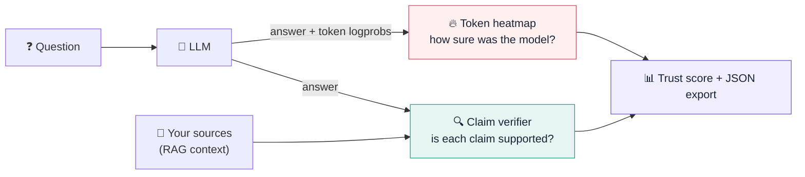

  

<h1 align="center">LLM Hallucination Detector</h1>

<b>Catch AI hallucinations before your users do.</b> 
Token-level confidence heatmaps + claim-by-claim verification against <i>your</i> sources.

  
  
  

---

## 🤔 The problem

Large language models write fluent, confident answers that are sometimes simply **wrong**. These are hallucinations: invented numbers, made-up citations, policies that don't exist. Fluency hides them, and the model's own confidence doesn't reliably flag them.

> **Example:** your support bot says *"Yes, you can return the used blender within **90 days**"*. The model was **90% confident** overall. Your policy says **30 days, unused items only**.

## 💡 The solution: two independent signals

| | 🔥 **Token confidence** | 🔍 **Evidence alignment** |
|---|---|---|
| **Question it answers** | Where was the model *guessing*? | Is each claim *backed by my documents*? |
| **Source** | `logprobs` from the model API | A verifier model checking against your context |
| **Catches** | Invented numbers, names, dates, citations | Contradictions and unsupported statements, *even when the model was confident* |

## 🖼️ See it in action

| Policy mismatch | Fabricated citation |
|---|---|
|  |  |
| **Invented statistics** | **Grounded answer ✅** |
|  |  |

## 🧭 Where to next?

| | Page | What you'll find |
|---|---|---|
| 🚀 | [[Getting Started]] | Run it locally in 60 seconds, then connect a model |
| ⚙️ | [[How It Works]] | Logprobs, claim checks and the trust-score formula, explained |
| 🎛️ | [[Analysis Modes]] | Demo, logprobs and verifier modes, and when to use each |
| 🧪 | [[Demo Examples]] | Walkthroughs of the five built-in scenarios |
| 🔧 | [[Configuration]] | Every environment variable |
| 🔌 | [[API Reference]] | `POST /api/analyze` request and response schema |
| 🐍 | [[Python Client and RAG]] | Guardrails, batch evaluation and pipeline recipes |
| 🧩 | [[Chrome Extension]] | Review ChatGPT and Claude answers in place |
| 🔒 | [[Security]] | Threat model and hardening |
| 🌐 | [[Live Demo and Hosting]] | GitHub Pages setup, limits and costs |
| ❓ | [[FAQ]] · [[Troubleshooting]] | Answers and fixes |

## ✨ Highlights

- **Zero dependencies.** Python standard library and vanilla JavaScript, nothing to `pip install`.
- **Any OpenAI-compatible API.** OpenAI, Azure OpenAI, vLLM, Together, Groq, LM Studio, Ollama (`/v1`) and more.
- **Local-first and private.** Your API key stays on your machine and never reaches the browser.
- **Built for pipelines.** HTTP API, Python client, JSON export, and batch evaluation to CSV.
- **Honest by design.** It never claims a score is *proof* of truth. Every signal is labelled for what it is.

> [!IMPORTANT]
> **Confidence is not correctness.** A model can be highly confident in a false claim, and a verifier can also be wrong. The trust score is a transparent heuristic for triage. Keep human review for legal, medical and financial decisions.
