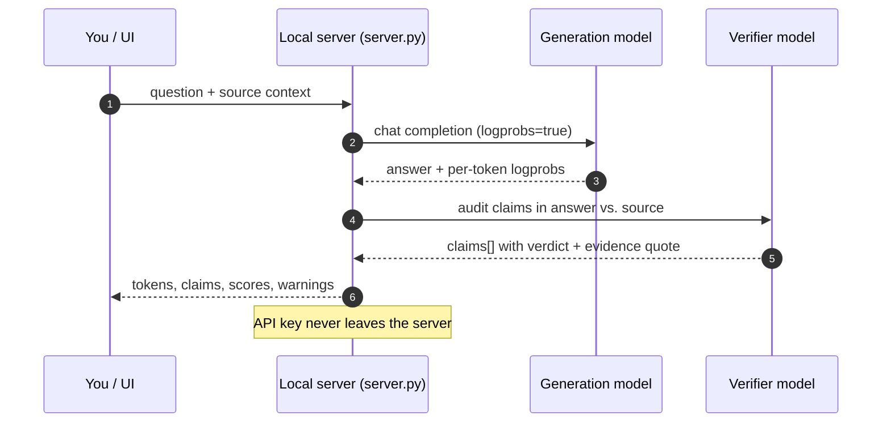
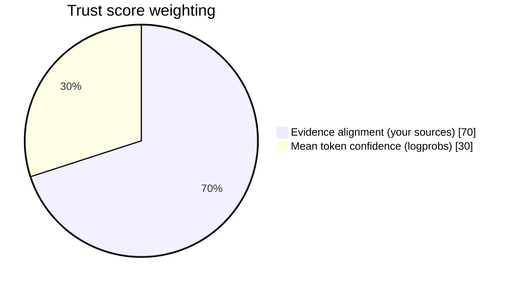

# ⚙️ How It Works

LLM Hallucination Detector deliberately keeps **two different signals** apart, because blending them hides the most dangerous failure: *a confident, fluent, wrong answer.*



## Signal A: 🔥 token confidence

For every token the model generates, the API can return its **log-probability**. We convert it to a probability:

```text
token_confidence = exp(logprob)        # 0.0 – 1.0
```

| Colour | Range | Meaning |
|---|---|---|
| 🟥 Red | **< 55%** | The model was unsure. Often an invented number, name or date. |
| 🟨 Amber | **55–84%** | Mixed. Worth a look. |
| 🟩 Green | **≥ 85%** | The model was confident. **Not** the same as correct. |

> [!WARNING]
> Green does not mean true. In the *Policy mismatch* demo, most of a contradicted answer is green. That's exactly why Signal B exists.

## Signal B: 🔍 evidence alignment

A verifier model splits the answer into up to **8 atomic claims** and labels each one against *your* source context:

| Verdict | Weight | Meaning |
|---|---|---|
| ✅ **supported** | 1.00 | The source entails the claim |
| ⚠️ **not in source** | 0.20 | The source doesn't establish it (possible fabrication) |
| ❔ **unverified** | 0.25 | No source was given, or the verifier couldn't decide |
| ❌ **contradicted** | 0.00 | The source conflicts with the claim |

Each weight is pulled toward 0.5 in proportion to the verifier's own uncertainty:

```text
claim_score     = (weight × certainty) + 0.5 × (1 − certainty)
evidence_score  = mean(claim_score) × 100
```

## The trust score

```text
trust_score = 0.70 × evidence_alignment + 0.30 × mean_token_confidence
```



| Situation | Score produced |
|---|---|
| Logprobs **and** source context | **Composite** (formula above) |
| Verifier only, **with** source | **Evidence-only** |
| **No** source context | **None**. Deliberately not scored, because there's nothing to ground against. |

> [!IMPORTANT]
> These weights are a transparent prototype heuristic, not a calibrated probability. Tune thresholds on your own labelled data before using the score as a hard gate.

## Prompt-injection hygiene

The question, context and answer are sent to the models as **JSON data**, with explicit instructions to treat them as untrusted. A malicious document that says *"ignore previous instructions"* is far less likely to steer the verdict. Still, no LLM-based check is injection-proof.
