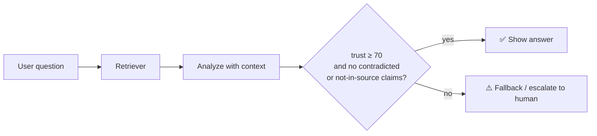

# 🐍 Python Client and RAG Recipes

`heatmap_client.py` is a single-file, zero-dependency client. Copy it into your project, or run it from the repo.

```python
from heatmap_client import HeatmapClient

client = HeatmapClient()          # uses $HEATMAP_URL or http://127.0.0.1:8787
client.health()                   # {'ok': True, ...}

run = client.analyze(
    "Can I return a used blender after 60 days?",
    context="Unused items in original packaging: return within 30 days.",
    mode="logprobs",
)
print(run["trust_score"], [c["status"] for c in run["claims"]])

# Already have an answer (ChatGPT, Claude, another service)?
review = client.verify_existing("Does this follow policy?", "Yes, 90 days.", context="30-day returns.")
```

## Recipe 1: 🛑 RAG guardrail



```python
risky = [c for c in run["claims"] if c["status"] in {"contradicted", "not_in_context"}]
if run["trust_score"] is None or run["trust_score"] < 70 or risky:
    escalate(run)          # show a safe fallback, log for review
else:
    reply(run["output"])
```

Full script: [`examples/rag_gate.py`](https://github.com/SYasJ/llm-hallucination-detector/blob/main/examples/rag_gate.py)

## Recipe 2: 📈 Batch evaluation to CSV

```bash
python3 examples/batch_eval.py examples/dataset.jsonl examples/output/report.csv
```

Input JSONL rows: `{"id", "prompt", "context", "response"?}`. Rows with `response` are verified as-is. The CSV gets trust score, evidence score, mean token confidence, and counts of each verdict, so you can compare prompts or models in a spreadsheet.

## Recipe 3: 🧪 CI regression test for your bot

```python
def test_returns_answer_is_grounded():
    run = HeatmapClient().analyze(QUESTION, context=POLICY)
    assert not [c for c in run["claims"] if c["status"] == "contradicted"]
```

Pair it with `examples/mock_provider.py` for deterministic, key-free pipeline tests.
