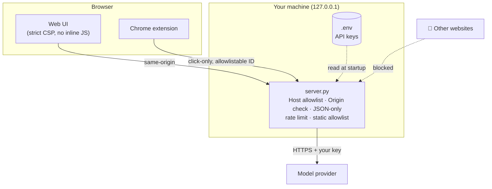

# 🔒 Security

LLM Hallucination Detector is a **local developer tool**. The server is designed to run on your own machine and be used by you.

| Protection | What it stops |
|---|---|
| Binds to `127.0.0.1` by default | Other machines on your network reaching an unauthenticated API |
| `Host` header allowlist | **DNS-rebinding** attacks from malicious sites |
| `Origin` check + JSON-only POST | Other websites silently spending your API credits |
| Static file allowlist, no directory listing | Downloading `server.py`, `.env`, tests or `.git` |
| Strict CSP, `X-Frame-Options: DENY`, `nosniff` | XSS and clickjacking |
| Per-IP rate limit, body caps, socket timeout | Runaway loops and resource exhaustion |
| Prompts sent as JSON data marked untrusted | Most prompt-injection attempts in documents |
| No payload logging | Prompts and documents ending up in logs |
| Keys only in `.env` (git-ignored) | Credentials in the browser or in commits |

> [!CAUTION]
> Setting `ANALYZER_HOST=0.0.0.0` exposes an API **without authentication**. Only do it on a trusted network, or put an authenticating reverse proxy in front.

**Found a vulnerability?** Please report it privately through [GitHub security advisories](https://github.com/SYasJ/llm-hallucination-detector/security/advisories/new), not in a public issue.
